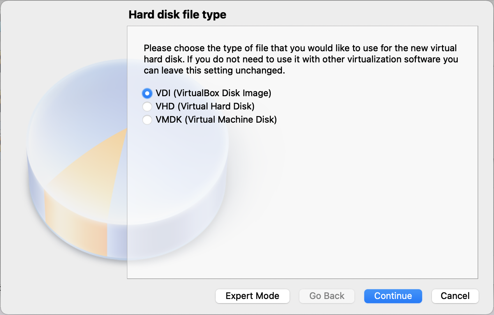
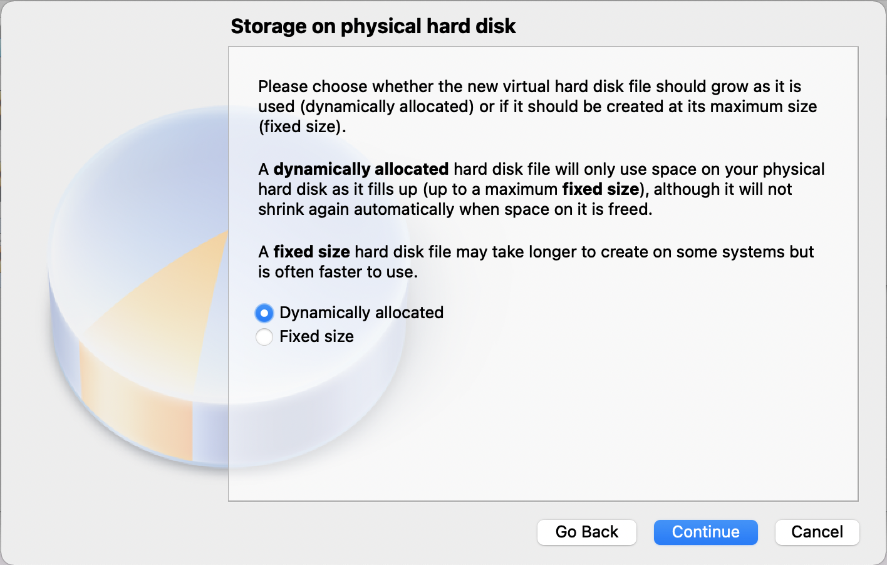
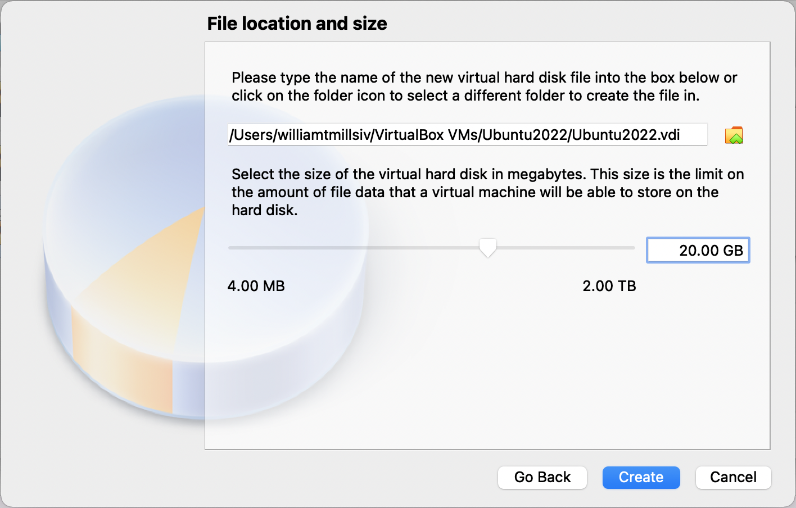
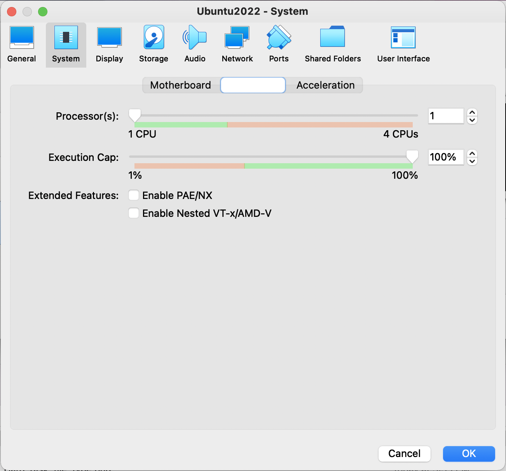
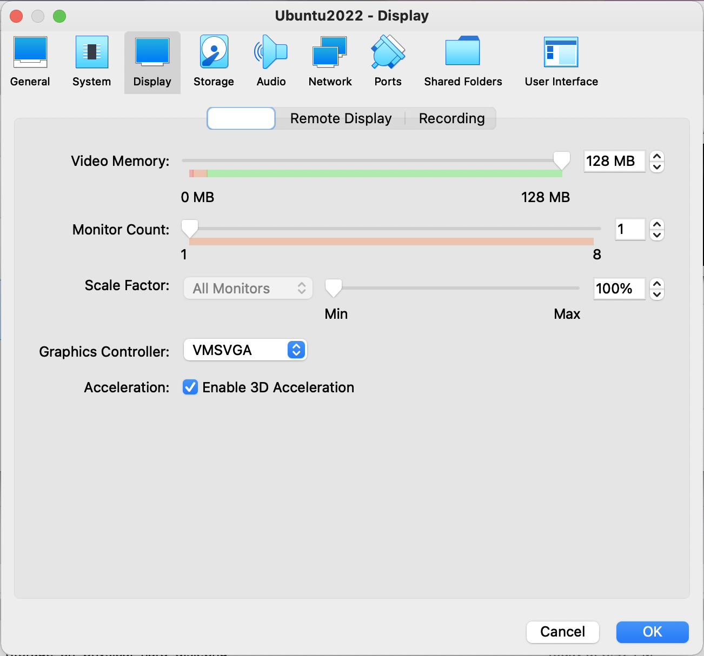

## Setting up VirtualBox

This tutorial will describe how to setup a virtual computer running a Linux-based operating system on your personal computer.

### Download VirtualBox

1. Visit [VirtualBox](https://www.virtualbox.org/).
2. Click the blue button that says 'Download VirtualBox 6.1' (though this button may contain a different number for future versions).
3. Click the link for your current operating system (Windows, (Mac) OS X, etc.). **NOTE:** Clicking this link will begin the download automatically.

### Download Ubuntu

1. Visit [Ubuntu](ubuntu.com).
2. Click on the 'Download' tab in the top right.
3. Under 'Ubuntu Desktop', click the green button that says '20.04 LTS' (though the number may be different in the future, this green button represents the newest, most well supported version of Ubuntu). **NOTE:** Clicking this button will begin the download automatically.

### Installing VirtualBox

1. Locate the VirtualBox file downloaded above.

    - For Mac, file should appear as: `VirtualBox-6.1.32-149290-OSX.dmg`
    - For Windows, file should appear as: `VirtualBox-6.1.32-149290-Win.exe`

2. Double click the file to begin installation and follow the on-screen prompts.

**NOTE:** Security setting on your computer may prevent VirtualBox from loading. If this occurs (on Mac),

1. Go to 'System Preferences'.
2. Click 'Security & Privacy'.
3. Next to the message that reads 'System software from developer "Oracle America Inc." was blocked from loading', click 'Allow'.

### Create a virtual computer

1. Open VirtualBox application (if not open already).
2. Select 'New'.
3. Fill out the 'Name and operating system' form and click 'Continue'.

    

4. Fill out the 'Memory size' form and click 'Continue'. This number should be kept below half of the RAM available on your computer. For example, on a computer with 16 GB of RAM, select 8 GB (8192 MB).

    

5. Fill out the 'Hard disk' form and click 'Create'.

    

6. Fill out 'Hard disk file type' form and click 'Continue'.

    

7. Fill out 'Storage on physical hard disk' form and click 'Continue'.

    

8. Fill out the 'File location and size' form and click 'Create'. The amount of memory you allocate to the virtual computer should depend on the needs of your bioinformatic pipelines and the memory available on your computer. An appropriate starting place would be 20 GB. If you should run out of space in the future, this number can be increased.

    

9. Click the 'Settings' (Gear) icon, select 'System', select 'Processor', and change the number of Processors to 1 CPU. This number should never be more than half of the number of processors on your computer. For example, on a computer with a dual-core processor, select 1 CPU.

    

10. While in the 'Settings' window, select 'Display', select 'Screen' (default page, white bar on left), change the video memory to 128 MB, and select 'Enable 3D Acceleration'. 

    

11. While in the 'Settings' window, select 'Storage', select 'Controller: IDE', click 'Adds optical drive' (blue disk with green plus sign), click 'Add' (blue disk with green plus sign), select file downloaded from Ubuntu above: `ubuntu-20.04.2.0-desktop-amd64.iso`, click 'Open', click 'Choose', click 'Empty' below 'Controller: IDE', click 'Removes selected storage attachment' (blue floppy disk with red x).

    

11. Create a folder that will interface between your computer and the virtual computer.

Shared Folders > Click the 'New Folder' icon

Folder Path: /Users/williamtmilsiv
Folder name: UbuntuSharing
Check 'Auto-mount

Click 'OK

12. Start Ubuntu 2021

13. Click 'Install Ubuntu'

Keyboard layout
Choose your keyboard layout: English (US) > English (US) > Continue

Updates and other software
What apps would you like to install to start with? > Minimal Installation (Web browser and basic utilities.)
Other options > Download updates while installing Ubuntu
Other options > Install third-party software for graphics and Wi-Fi hardware and additional media formats
Continue

Installation type
This computer currently has not detected operating system. What would you like to do? > Erase disk and install Ubuntu > Install Now > Continue

Where are you? > New York > Continue

Who are you?
Your name: William Mills
Your computer's name (autofill): william-VirtualBox
Pick a username (autofill): william
Choose a password: 
Confirm your password: 
Require my password to log in
Continue


You can use the [editor on GitHub](https://github.com/williamtmills/VirtualBoxSetup/edit/main/README.md) to maintain and preview the content for your website in Markdown files.

Whenever you commit to this repository, GitHub Pages will run [Jekyll](https://jekyllrb.com/) to rebuild the pages in your site, from the content in your Markdown files.

### Markdown

Test. Markdown is a lightweight and easy-to-use syntax for styling your writing. It includes conventions for

```markdown
Syntax highlighted code block

# Header 1
## Header 2
### Header 3

- Bulleted
- List

1. Numbered
2. List

**Bold** and _Italic_ and `Code` text

[Link](url) and 
```

For more details see [Basic writing and formatting syntax](https://docs.github.com/en/github/writing-on-github/getting-started-with-writing-and-formatting-on-github/basic-writing-and-formatting-syntax).

### Jekyll Themes

Your Pages site will use the layout and styles from the Jekyll theme you have selected in your [repository settings](https://github.com/williamtmills/VirtualBoxSetup/settings/pages). The name of this theme is saved in the Jekyll `_config.yml` configuration file.

### Support or Contact

Having trouble with Pages? Check out our [documentation](https://docs.github.com/categories/github-pages-basics/) or [contact support](https://support.github.com/contact) and we’ll help you sort it out.
